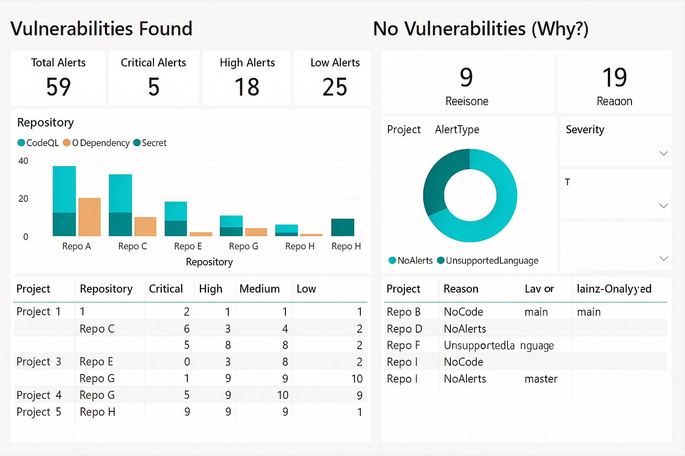

## GitHub Advanced Security Dashboards for Azure DevOps

This folder contains the **Power BI dashboards** and supporting assets that visualize
**GitHub Advanced Security (GHAS) for Azure DevOps** results across repositories.

> The dashboards answer two questions:
> 1) **Which repositories have vulnerabilities?**  
> 2) **Which repositories were scanned but have no vulnerabilities**, and **why** (Unsupported language, No code, or No alerts found)?

---

### 🗂️ What’s in this folder


```
Dashboard/
├── Dashboarding.md                   <!-- Details the power query and the DAX -->
├── sample-dashboard.png              <!-- Screenshot used above -->
├── sample-data.py                    <!-- Sample seed data -->
├── sample-data/                      <!-- Optional: place sample CSVs here for quick testing -->
│   ├── alerts.csv
│   ├── repos_with_vulnerabilities.csv
│   └── repos_without_vulnerabilities.csv
Scripts/                              <!-- Script to export the data for dashboard -->
├── Export-GHAS-ADODashboards.ps1
azure-pipeline.yml                    <!-- Pipeline to run the script -->
README.md
```

> **Tip:** If you’re using the end‑to‑end exporter, the CSVs are generated by
> `../Export-GHAS-AdoDashboards.ps1` or the pipeline in `../azure-pipelines.yml`.  
> You can point this PBIX to either the exporter’s output folder or use `Dashboard/sample-data.py`.

---

### 🧩 Data inputs (CSV schema)

The dashboards expect three CSV files with the following columns:

- **alerts.csv**  
  `Organization, Project, Repository, RepositoryId, AlertId, AlertType, Severity, State, Title, RuleId, RuleName, RepoUrl, FirstSeen, LastSeen`

- **repos_with_vulnerabilities.csv**  
  `Organization, Project, Repository, RepositoryId, DefaultBranch, SupportedLangs, HasAnyCode, CodeQLAnalyzedBranches, Alerts_Total, Alerts_Code, Alerts_Dependency, Alerts_Secret, Sev_Critical, Sev_High, Sev_Medium, Sev_Low`

- **repos_without_vulnerabilities.csv**  
  `Organization, Project, Repository, RepositoryId, DefaultBranch, SupportedLangs, HasAnyCode, CodeQLAnalyzedBranches, Reason`

> These files are produced by the exporter script using Azure DevOps **Advanced Security** REST APIs (Alerts List/Get) and (optionally) the **Analysis** API for branch coverage.

---

### 🚀 Quick Start (using the provided sample CSVs)

1. **Open Power BI Desktop**.  
2. **Get Data ▸ Folder** ➜ browse to `Dashboard/sample-data/`.  
3. When the preview appears, choose **Transform Data** (don’t auto‑combine).  
4. In Power Query, create three queries using the code in **`Dashboard/Dashboarding.md`**:  
   - Replace the folder path inside each query to point at `Dashboard/sample-data/`.
5. Click **Close & Apply**.
6. In the Report view, add the ready‑made measures by pasting DAX from **`Dashboard/Dashboarding.md`** into a new measure group under the `ReposWithVulnerabilities` table.
7. Build the two pages following **“Page layouts”** below (or mirror the screenshot).

You now have a working PBIX backed by sample data.

---

### 🔄 Pointing to real data (exporter / pipeline)

When you have PAT & org details:

- Run the exporter from the repo root:
  ```powershell
  .\Export-GHAS-AdoDashboards.ps1 `
    -Organization "<your-org>" `
    -Pat "<your-PAT>" `
    -OutputDir "C:\ghas-dash"


Or schedule it via Azure Pipelines using ../azure-pipelines.yml (publishes the CSVs as artifacts).
In Power BI Desktop, change the Folder data source to the exporter output path (e.g., C:\ghas-dash) and Refresh.

No model changes are required—the dashboards will update automatically.

### 🎨 Page layouts

#### 📸 Dashboard Preview

  
This screenshot uses the sample CSVs produced by the included mock data and query template.*

#### Page 1 — Vulnerabilities Found

Cards: Total Alerts, Critical, High, Medium, Low
(from DAX measures in PowerBI/Measures.dax)
Clustered bar: Repository vs series = Alerts (CodeQL / Dependency / Secret)
Matrix: Rows = Project → Repository; Values = severity measures
Slicers (optional): Project, SupportedLangs, DefaultBranch, AlertType (from Alerts table)

#### Page 2 — No Vulnerabilities (Why?)

Donut: ReposWithoutVulnerabilities[Reason]
Table: Project, Repository, Reason, SupportedLangs, CodeQLAnalyzedBranches
Card: Count of repositories
Slicers: Project, Reason


### ✅ Features

* Pulls Advanced Security alerts (CodeQL, Dependency, Secret scanning) via Azure DevOps REST APIs.
* Detects CodeQL-supported languages and code presence.
* Classifies repos into two categories for reporting.
* Exports three CSVs for sample dashboard:

  - alerts.csv – detailed alert-level data.
  - repos_with_vulnerabilities.csv – summary for repos with alerts.
  - repos_without_vulnerabilities.csv – summary for repos with no alerts and reason.


Includes Power BI template (Power Query + DAX) for two dashboards.


### 📚 References

- [Advanced Security Alerts](https://learn.microsoft.com/en-us/rest/api/azure/devops/advancedsecurity/alerts)
- [Codeql overview](https://learn.microsoft.com/en-us/codeql/codeql-overview)
- [PoewrBI Desktop](https://powerbi.microsoft.com/desktop)


### ✅ Next Steps

* Replace sample CSVs with real exports from your Azure DevOps org.
* Automate with the included Azure Pipeline for scheduled refresh.
* Connect Power BI to your pipeline artifact or storage for live dashboards.
